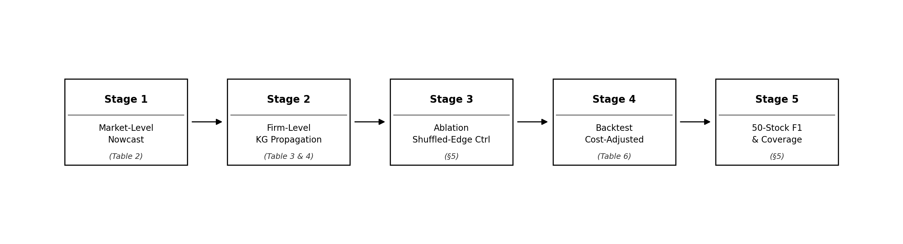

# Sentiment-to-Score Pipeline — Mathematical Specification

This document provides the complete mathematical specification of the
two-tier hierarchical sentiment scoring system described in:

> *Cross-Market Sentiment Propagation via Firm-Level Knowledge Graphs*,
> ICAIF 2026.

---

## Architecture

The pipeline has two parallel sides that merge in the Two-Tier Calibration step.

**Taiwan-Side Signal Construction (Stages 1–5)** converts raw Taiwanese and
U.S. news into per-firm daily sentiment features. **Two-Tier Predictive
Calibration** maps those features into market- and stock-level scores on
$[1, 100]$.

---

## Fixed Parameters

All parameters below are fixed **ex ante** — set before the 2024–2026Q1
held-out window and never re-tuned on test data.

| Symbol | Value | Role |
|---|---|---|
| $\beta$ | 0.25 | Taiwan weight in Tier 1 composite |
| $\lambda_r$ | 0.35 | Repetition-discount decay rate |
| $\lambda_d$ | 0.46 | Carry-over time-decay rate |
| $\gamma$ | 0.5 | KG hop-decay factor |
| $H$ | 2 | Maximum KG propagation depth (hops) |
| $\Delta_{\max}$ | 50 | Single-path exposure cap |
| $W$ | 5 days | Carry-over window ($k = 0 \ldots 4$) |
| $N$ | 15 | Lookback window for repetition discount (trading days) |

---

## §3.1 Taiwan News Pipeline

### Stage 1 — News Classification and LLM Scoring

Each Taiwanese news item passes through a hierarchical LLM classification and
filtering module. The filter removes routine, sponsored, forwarded, and
cross-source near-duplicate reports of the same event. The LLM assigns:

- a **top-level class** $c \in \{\text{macro, market, company, industry, policy, other}\}$, and
- an **anchor sentiment score** $S_{\text{raw}} \in [1, 100]$, where $50$ is neutral.

### Stage 2 — KG Supply-Chain Impact Propagation

The proprietary firm-level knowledge graph $\mathcal{G} = (\mathcal{V}, \mathcal{E})$
covers 576 TWSE-listed firms plus overseas anchor nodes (suppliers, customers,
competitors). Each directed edge $e = (a, c) \in \mathcal{E}$ carries an
exposure weight $w_{a,c}$ fixed by edge type:

| Edge type | Weight $w_{a,c}$ | Sign convention |
|---|---|---|
| SUPPLIES\_TO (supplier → customer) | Revenue-share fraction | Same direction as anchor shock |
| COMPETES\_WITH (bidirectional) | Signed halo weight | Opposite for industry-wide demand; same for supply-chain shocks |
| PRODUCT\_LINE / TECH\_NODE | Segment-share fraction | Same direction |

The **path contribution** from anchor $a$ to TWSE firm $c$ via a path of
length $h$ is:

$$\Delta p_{a \to c} = S_{\text{raw}} \cdot w_{a,c} \cdot \gamma^{h}, \qquad \gamma = 0.5$$

Propagation is limited to $H = 2$ hops. Each path contribution is capped:

$$\Delta p_{a \to c}^{\text{capped}} = \mathrm{clip}\left(\Delta p_{a \to c},\ {-\Delta_{\max}},\ {+\Delta_{\max}}\right)$$

### Stage 3 — Impact Scoring with Decay

#### Repetition Discount

Repeated coverage of the same firm within a 15-trading-day lookback window is
discounted to prevent headline-stuffing. Let $t_i$ index prior appearances of
the same firm; the cumulative repetition weight is:

$$W_{\text{rep}} = \sum_{i} e^{-\lambda_r (t - t_i)}, \qquad \lambda_r = 0.35$$

The stale-news discount factor and adjusted score are:

$$f = \frac{1}{1 + W_{\text{rep}}} \in (0,\,1], \qquad S_{\text{adj}} = 50 + (S_{\text{raw}} - 50)\cdot f$$

#### Carry-Over Window

The adjusted score is carried forward over the event day plus four following
trading days using exponential decay:

The final score is $S_{\text{final}} = 50 + \sum_{k} w_k \delta_k$ **(Eq. 1)**, where
$w_k = e^{-\lambda_d k}$ with $\lambda_d = 0.46$, and $\delta_k = S_{j,k,\text{adj}} - 50$.
The carry-over window spans $k = 0 \ldots 4$ (event day + 4 following trading days).
Implied weights: **100%, 63%, 40%, 25%, 16%**. Result clipped to $[1, 100]$.

### Stage 4 — Aggregation to Daily Market Sentiment

All per-event impact scores are aggregated into a single market-level Taiwan
feature using **capitalisation-weighted** averaging:

**(Eq. 2)** $\text{score}^{\text{local}}(t) = 50 + \sum_j TW_j \cdot w_j$, where $w_j = \text{cap}_j / \sum_{j'} \text{cap}_{j'}$.

This output feeds Tier 1 calibration only; it is **not** used directly as a
stock-level score.

### Stage 5 — Per-Firm SprintScore

The SprintScore consolidates all direct and KG-propagated, decay-adjusted
Taiwan event impacts for firm $j$ on date $t$:

where $\mathcal{E}\_{j,t}$ is the set of events timestamped **before 08:59
Taipei time** on day $t$, and $\omega\_{c,j,t}$ is the normalised
direct-relevance weight for event $c$ on firm $j$.

---

## §3.2 U.S. News Pipeline

The U.S. pipeline runs in parallel and produces a market-level score
$\mathrm{US}\_{t-1}$ and stock-level scores $\mathrm{US}\_{j,t-1}$ for the
prior U.S. cash session.

**Stage 1** scores the four U.S. equity indexes (SOX, NDX, SPX, DJI) as the
cash-session anchor using the same LLM classifier. After-hours items are
session-aligned so only information available before the TWSE open enters the
score.

**Stage 2** identifies U.S. anchors — stories with direct commercial links to
TWSE constituents — and maps them onto the Taiwan universe via keyword
expansion trained on the KG product-line layer. Taiwanese ADRs (TSM, UMC)
are a special case: their intraday U.S. move is directly informative.

**Stage 3** ranks the top 15 most affected TWSE firms by revenue-share
strength with signed impact scores. A separate LLM verifies anchors,
direction, and ranking before scores enter the U.S. aggregate.

---

## §3.3 Two-Tier Hierarchical Sentiment Scoring System

### Tier 1 — Market-Level Score

Tier 1 combines two market-level inputs with a fixed blend weight $\beta = 0.25$:

A logistic calibration maps the composite to an up-move probability:

**(Eq. 5)** $p\_t = \sigma(a^{(1)} + \rho^{(1)} C^{(1)}\_t)$

The calibrated market-level score is then:

**(Eq. 6)** $M\_t = 1 + 99 \cdot \sigma(a^{(1)} + \rho^{(1)} C^{(1)}\_t) \in [1, 100]$

Values near 100 indicate strongly bullish market conviction; near 1 bearish;
50 neutral. Parameters $a^{(1)}$ and $\rho^{(1)}$ are estimated by
maximum-likelihood cross-entropy on walk-forward training folds.

### Tier 2 — Stock-Level Score

For each of the 576 TWSE stocks, Tier 2 combines three intentionally separated
inputs subject to a simplex constraint:

**(Eq. 7)** $C\_{j,t}^{(2)} = a\_j \cdot TW\_{j,t} + b\_j \cdot M\_t + c\_j \cdot U\_j$, where $U\_j$ is the prior-session U.S. score for firm $j$; subject to $a\_j + b\_j + c\_j = 1$.

A firm-specific logistic calibration produces the final score:

**(Eq. 8)** $p\_{j,t} = \sigma(a\_j^{(2)} + \rho\_j^{(2)} \cdot C\_{j,t}^{(2)})$

**(Eq. 9)** $S\_{j,t} = 1 + 99 \cdot p\_{j,t} \in [1, 100]$

Pool averages: $a \approx 0.18$, $b \approx 0.52$, $c \approx 0.30$.
Parameters $(a_j, b_j, c_j)$ and $(a^{(2)}_j, \rho^{(2)}_j)$ are estimated
per-stock using the same walk-forward cross-entropy criterion.

$S_{j,t}$ is the **Final Stock Sentiment Score** shown at the bottom of
Figure 2 — a stock-up probability rescaled to $[1, 100]$.

### Per-Day Decision Flow

On date $t$, the information set $\mathcal{I}_t$ contains all items
timestamped before 08:59 Taipei time. The scoring sequence is:

1. Taiwan news → Stages 1–5 → $TW_{j,t}$ (SprintScore, per firm)
2. Taiwan news → Stage 4 → $\text{score}^{\text{local}}(t)$ (market aggregate)
3. U.S. news → U.S. pipeline → $\mathrm{US}\_{t-1}$, $\mathrm{US}\_{j,t-1}$
4. $\text{score}^{\text{local}}(t)$ + $\mathrm{US}\_{t-1}$ → Tier 1 → $M_t$
5. $TW_{j,t}$ + $M_t$ + $\mathrm{US}\_{j,t-1}$ → Tier 2 → $S_{j,t}$

$S_{j,t}$ is the input feature for downstream trading decisions (e.g.
long–short portfolio construction, position sizing).

---

## Notation Summary

| Symbol | Definition |
|---|---|
| $t$ | TWSE trading day |
| $j$ | TWSE-listed stock index |
| $c$ | News event index |
| $S_{\text{raw}}$ | Raw LLM anchor sentiment score $\in [1,100]$ |
| $S_{\text{adj}}$ | Repetition-discounted score |
| $S_{\text{final}}$ | Carry-over-adjusted final event score |
| $TW_{j,t}$ | Per-firm SprintScore (Stage 5 output) |
| $\text{score}^{\text{local}}(t)$ | Cap-weighted Taiwan market aggregate (Stage 4) |
| $\mathrm{US}_{t-1}$ | Prior-session U.S. market-level score |
| $\mathrm{US}_{j,t-1}$ | Prior-session U.S. stock-level score for firm $j$ |
| $M_t$ | Tier 1 market-level calibrated score $\in [1,100]$ |
| $S_{j,t}$ | Final Stock Sentiment Score $\in [1,100]$ |
| $\mathcal{E}_{j,t}$ | Events for firm $j$ in $\mathcal{I}_t$ |
| $\omega_{c,j,t}$ | Normalised direct-relevance weight |
| $w^{\text{cap}}_{j,t}$ | Capitalisation weight for firm $j$ on day $t$ |
| $w_{a,c}$ | KG edge exposure weight from anchor $a$ to firm $c$ |
| $\sigma(\cdot)$ | Logistic (sigmoid) function |
